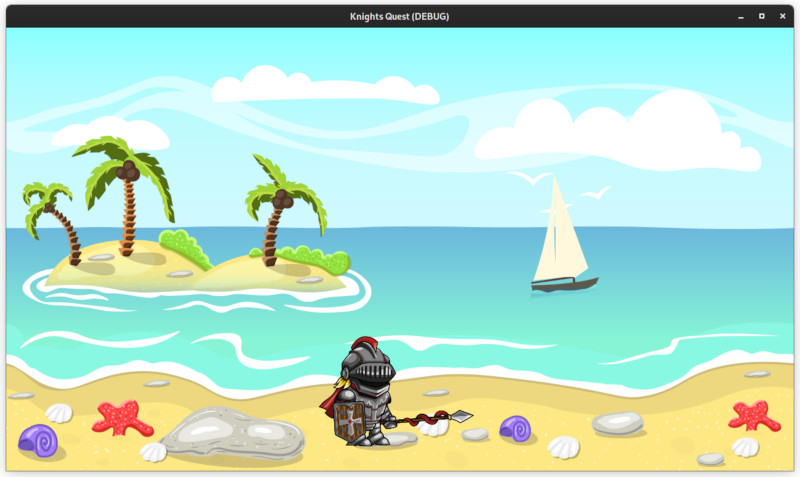

# HBHS Gamedev Club - Knight's Quest

Welcome to Knight's Quest, a simple 2D side-scroller game created by the HBHS Gamedev Club! In this game, you will play as the brave knight who must fight your way through various levels and defeat enemies to save the kingdom.

## Getting Started
To get started, you will need to download the game files from our GitHub repository. Once you have downloaded the files, launch [Godot 3.5.1](https://www.godotengine.org) and import the project.godot file to edit or launch the game.

## Playing the Game
In Knight's Quest, you will use the A and D keys to move your character, and the W key to jump. You can also use the space bar or left click the mouse to attack enemies and defeat them.

Your goal is to make it through each level and defeat the boss at the end to save the kingdom. Be sure to collect coins along the way to increase your score!

## Contact Us
If you have any questions or feedback about Knight's Quest, please feel free to contact us on Tuesday's at Mr. Crossetts room. We would love to hear from you!

## Acknowledgements
We would like to thank the HBHS Gamedev Club members for their hard work and dedication in creating this game. We hope you enjoy playing Knight's Quest!